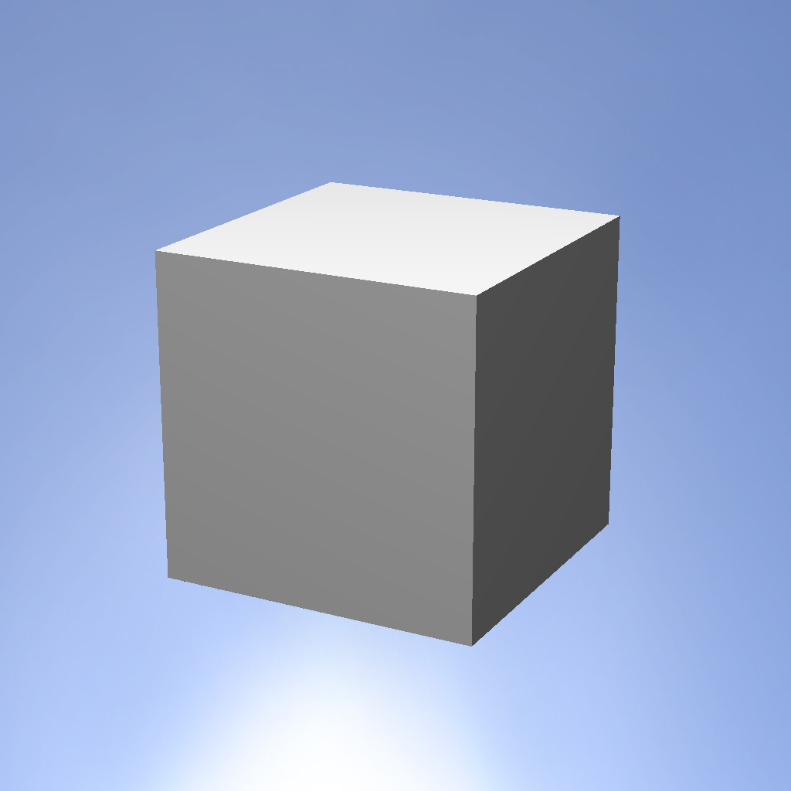
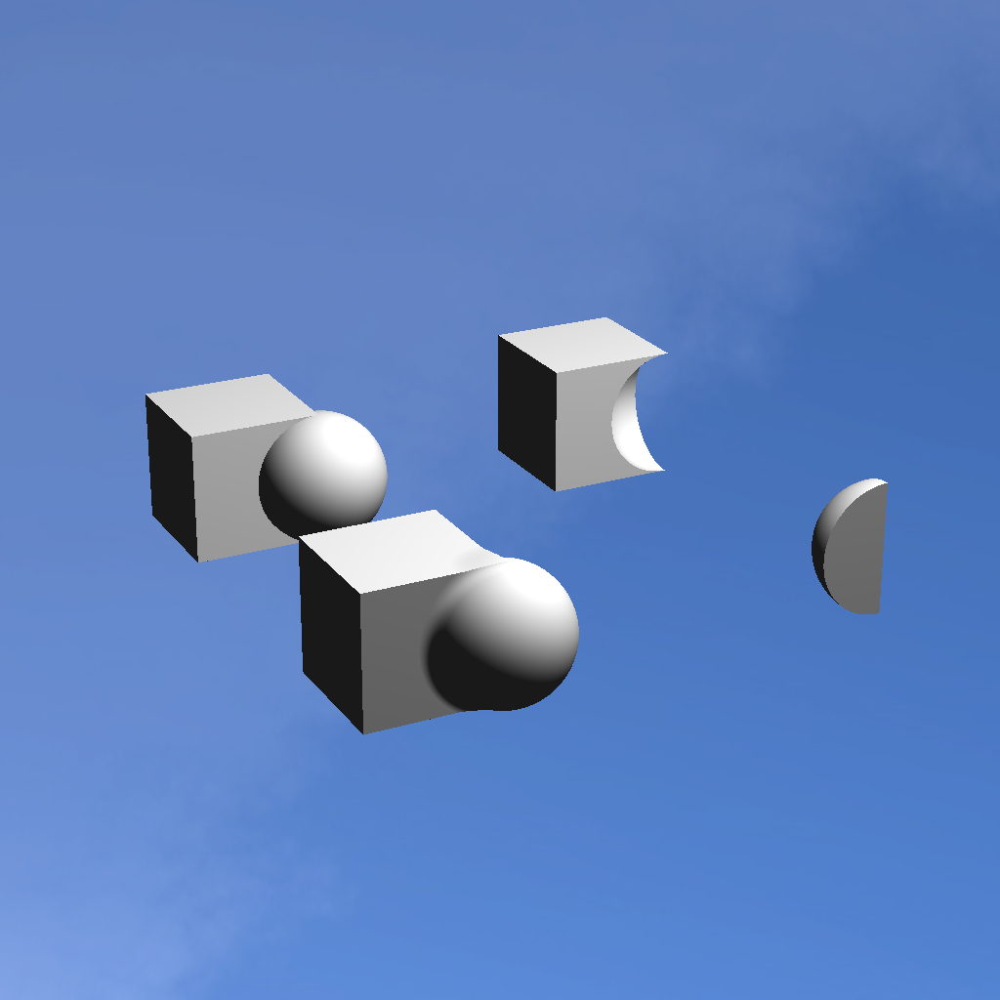
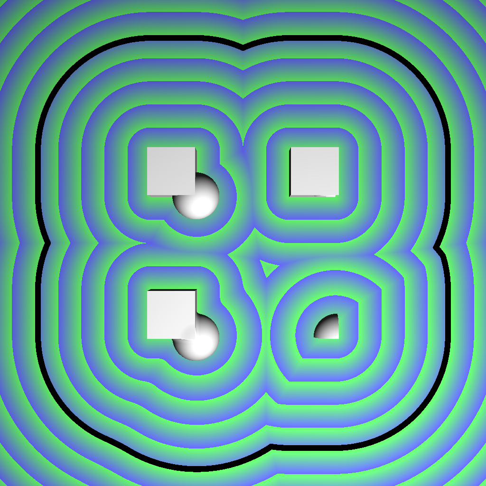
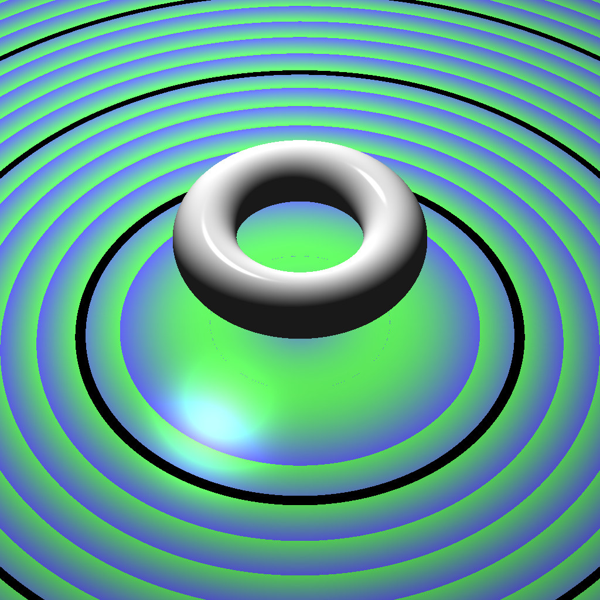
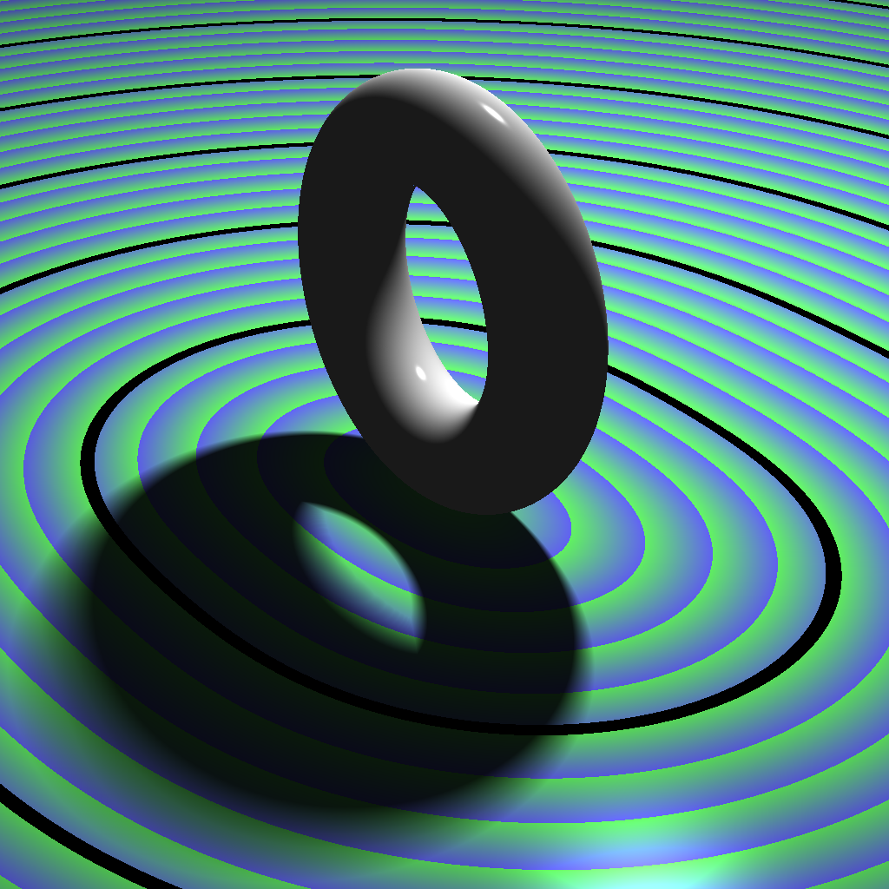
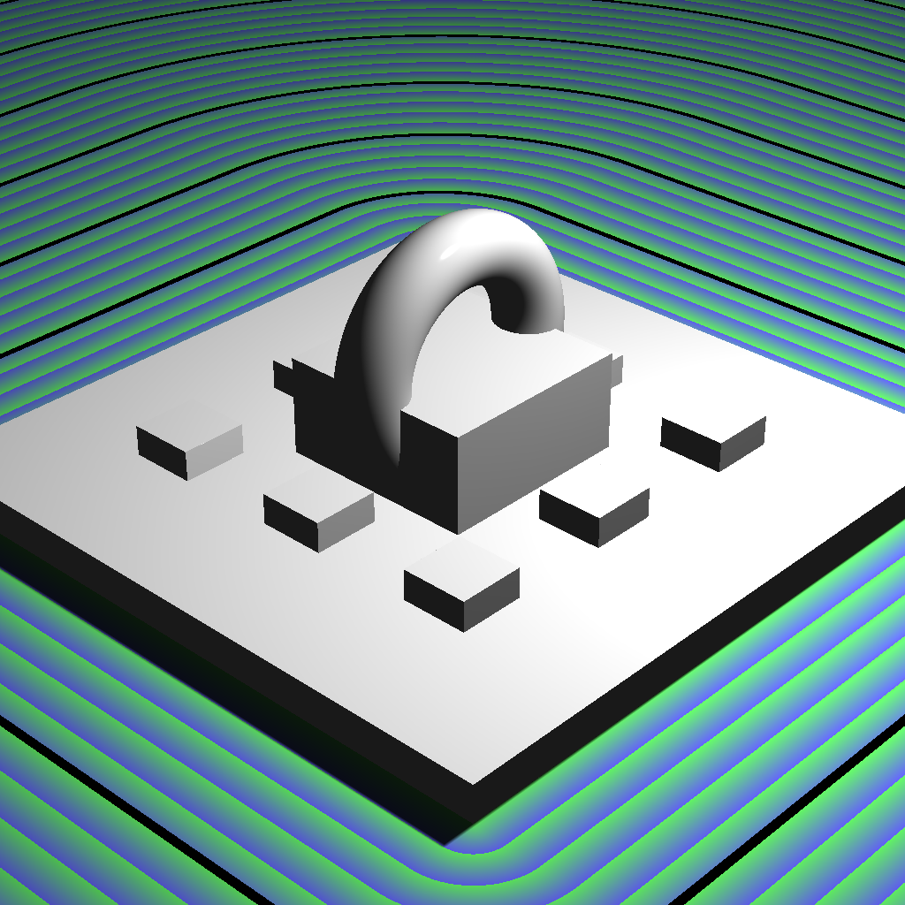

# further_graphics_tick

* generating a few graphics scenes using signed distance fields
* instructions found at: https://www.cl.cam.ac.uk/~gd355/teaching/ticks/FGraph/tick.pdf

## Task1

## Task2

## Task3

## Task4

## Task5

## Task6

